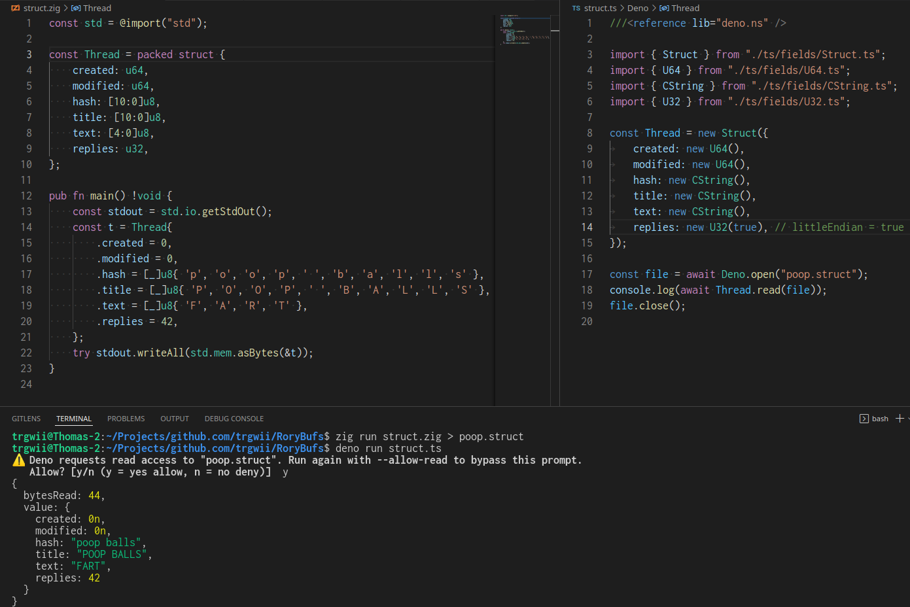
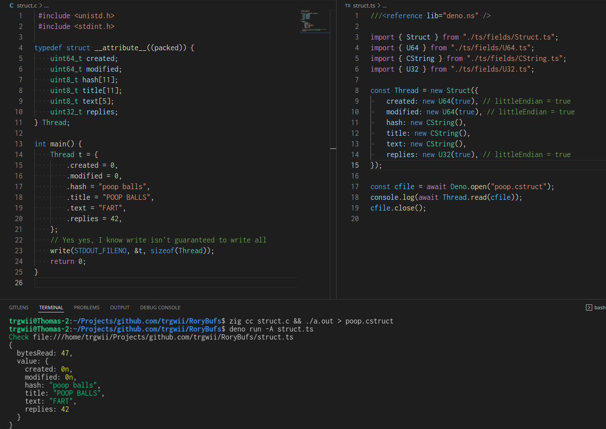

# RoryBufs

This is an efficient binary serialization format.

## Considerations

This format does not offer versioning, migration, or modifying schema and
reusing existing buffers.

Changing the order or names of fields changes the schema, making existing
buffers incompatible. This is verified by checksum. Internally, buffers are
versioned, and will fail with newer versions of this library.

The intended usecase is for short-lived buffers over a transport protocol, for
example TCP or Websockets.

## TypeScript usage:

```sh
deno run ts/examples/basic_usage.ts
```

([ts/examples/basic_usage.ts](ts/examples/basic_usage.ts))

## Demo:





## Nodejs:

```js
import { createReadStream, createWriteStream } from "fs";
import {
	F64,
	fromReadable,
	fromWritable,
	Optional,
	Struct,
	Text,
	U8,
} from "rorybufs";

const User = new Struct({
	id: new F64(),
	is_bot: new U8(),
	first_name: new Text(new U8()),
	last_name: new Optional(new Text(new U8())),
	username: new Optional(new Text(new U8())),
	language_code: new Optional(new Text(new U8())),
	can_join_groups: new Optional(new U8()),
	can_read_all_group_messages: new Optional(new U8()),
	supports_inline_queries: new Optional(new U8()),
});

const ws = createWriteStream("test.buf");
const writer = fromWritable(ws);

(async () => {
	await User.write({
		id: 42,
		is_bot: 0,
		first_name: "Thomas",
		last_name: "Rory",
		username: "trgwii",
		language_code: "no",
		can_join_groups: null,
		can_read_all_group_messages: null,
		supports_inline_queries: null,
	}, writer);
	await new Promise((resolve) => ws.end(resolve));
	const rs = createReadStream("test.buf");
	const reader = fromReadable(rs);
	console.log(await User.read(reader));
})();
```
